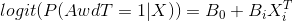
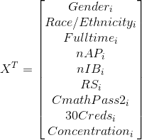

# Road Map Project Community and Technical College Technical Appendix

## Data Sources
The analyses contained in this project combine students’ high school enrollment records with CTC and National Student Clearinghouse (NSC) college enrollment records. CTC records are collected from the individual colleges by the State Board for Community and Technical Colleges (SBCTC). ERDC performs all matching of student information between data sets, providing CCER with linked research IDs that allow us to perform longitudinal analyses. ERDC does not provide us with data for students outside the Road Map region.

## Student Cohort Selection
Our cohort includes high school graduates, and only those who enroll in CTCs within one year of graduating high school (called “direct enrollees”). We include student who enroll in the fall, and also include students enrolling in summer, winter and spring. For students who first enroll in summer, we also require that they enroll in an additional quarter during their first year to be included. Although these definitions make our rates difficult to directly compare to other colleges’ and to state and national statistics, they more comprehensively identify the group of recent high school graduates we seek to understand. We currently have two cohorts of students that we can measure in terms of their three year outcomes after high school (classes 2011 and 2012).
## Technical Definitions of Disaggregation Categories
**Race/Ethnicity:** The racial or ethnic group designated by the student’s high school.

**Full-Time Student:** In this report, students are considered full-time if their average per-quarter course-load is 12 or more credits. To compute this, we divide a student’s total credits enrolled over the 3-year period by their total number of enrolled quarters (omitting any credits and enrollments during summer quarters).

**Running Start Student:** To be counted, students must have participated in Running Start at any local CTC, and are counted even if they enroll in a different CTC after graduating high school than the CTC at which they took courses as part of Running Start. We use the field provided in SBCTC enrollment data that indicates whether a student has participated in Running Start at a particular institution.

**Avoiding Developmental Education:** Students are considered not college-ready if they enroll in any pre-college coursework in math or English at any time during the 3-year period. We follow the SBCTC definition of pre-college level courses, which counts any course numbered below 100 to be at the pre-college level.21 College-ready students are those who did not take pre-college math or English during the 3-year period. The group of college-ready students may include some students that never took college-level math or English and thus may have either dropped out of college before taking college-level courses or were in a certificate program that did not require college-level math or English courses.

**Advanced Placement Participation**: This indicator is a continuous measure of the number of *passed* AP courses a student has accumulated in their HS years.

**International Baccalaureate Participation**:This indicator is a continuous measure of the number of *passed* IB courses a student has accumulated in their HS years.

## Technical Definitions of Indicators
For each indicator, time is measured in quarters (1 year = 4 quarters), and starts at the first quarter a student enrolls during the academic year directly following their high school graduation year.

### **College-Ready in Math in First Two Years**
This indicator measures the proportion of students that were college-ready in math by the end of their second year (i.e. Student enrolled and passed a college-level math course either in year one and/or by the end of the second year).

**Numerator:** The number of students that enroll and pass one or more college math courses during their their first two years.

**Denominator:** All students included in the cohort (see section ‘Student Cohort Selection’)

### **Becoming College-Ready in Math**
This indicator measures the proportion of students that were not college-ready in math by the end of their first year but enrolled and passed a college-level course by the end of their second year.

**Numerator:** The number of students that enroll and pass one or more college math courses during their second year.

**Denominator:** All students that enrolled in a remedial course in their first year.

### **Completing 30 College Credits Within One Year** 
A student meets this metric if they complete 30 or more college-level credits within one full academic year of their first enrollment.

**Numerator:** The number of students that earn 30 or more college-level credits during their first year.

**Denominator:** All students included in the cohort (see section ‘Student Cohort Selection’).

### **Concentration in First Year**
This indicator measures whether students have an accumulation of 15 credits or more in a specific subject area as defined by the [Classification of Instructional Programs (CIP)](https://www.sbctc.edu/colleges-staff/data-services/coding-and-reporting-guidelines.aspx) course codes.

**Numerator:** Students that accumulated 15 or more credits in a specific subject area by the end of their first year (i.e. Science, Math, English, etc.).

**Denominator:** All students included in the cohort (see section ‘Student Cohort Selection’).

## Outcomes
### Completing a Degree or Transferring to a 4-year College Within Three Years
This indicator shows student status at the end of three full academic years following high school graduation. As a
result, students who first enroll in winter or spring terms are given less time between their first
enrollment and the time their outcome is measured, as compared to students first enrolling in the fall term.
Completions include all types of 2-year associate degrees and workforce degrees as well as short-term (fewer than 45
credits) and long-term (45 credits or more) certificates.

### *Outcome Categories for Completing a Degree or Transferring to a 4-Year College*
**Any Completion No Transfer:** Student has completed a degree or credential but has not transferred to a
4-year college by their third year.

**Any Completion and Transfer to 4-year:** Student has completed a degree or credential and has transferred
to a 4-year college by their third year. Students are considered to have transferred to a 4-year college if they
do not enroll in a local CTC during their third year and enroll in a 4-year college during any academic year
after their final enrollment year in a local CTC, but prior to the end of their third year. We use National
Student Clearinghouse enrollment and completion records to determine whether a student has enrolled in
a 4-year college outside of local CTCs.

**Transfer to 4-year (no completion):** Student has not completed a degree or credential but has transferred
to a 4-year college by their third year. See above bullet for a definition of transfer to 4-year college.

**Still Enrolled:** Student has not completed a degree or credential, has not transferred to a 4-year college by
their third year, and is still enrolled in a local CTC in their third year.

**Left CTCs:** Student has not completed a degree or credential, has not transferred to a 4-year college by
their third year, and is no longer enrolled in a local CTC in their third year.

## Model Parameters and Specification
Student outcomes for the most recent cohort of students were assessed using a logistic regression model, which looked at the probability that a student will receive any type of award or transfer, conditional on a set of predictors. (see below).

> We specify a logistic regression function:
>
> 
>
> Where,
>
> 
>
> *1 = Student gets an award or transfers within 3 years.*
> 
> *0=Student is still enrolled or has left the RMP CTC system.*
>
> and,
> 
> 
> 
> *Variable Defintions:*
> 
> | Variable in model | Indicator |
> |------------------ |-----------|
> | Gender            | Student reported gender.|
> |Race/Ethnicity     | Student reported race/ethnicity where 'white' in the reference category. |
> | Fulltime        | Fulltime status flag. |
> | nAP             | The number of passed AP courses during HS. |
> | nIB             | The number of passed IB courses during HS. |
> | CmathPass2      | Becoming college-ready in math by year 2 as compared to the cohort. |
> | 30Creds         | Completing 30 college credits within one year. |
> | Concentration   | Accumulation of 15 credits or more in a specific subject area. |
> 

